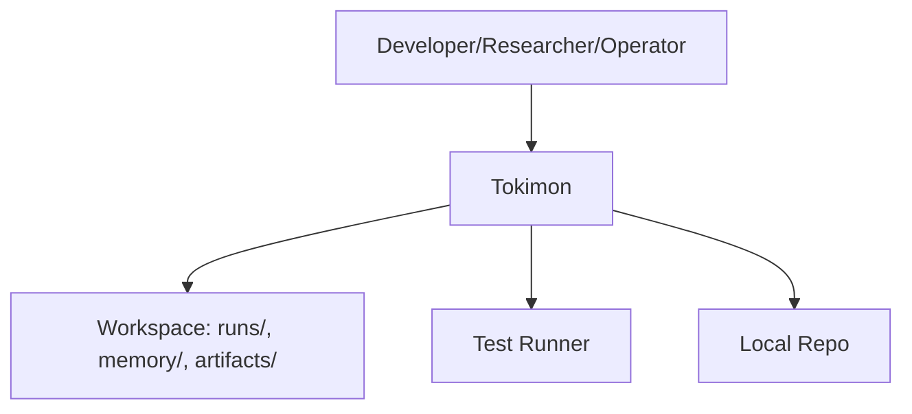

# C4 Level 1 - Context - Tokimon

## System Context
Tokimon is a hierarchical agent system that orchestrates workflows, persists memory, and is evaluated via benchmarks.

## Notes
- Tokimon operates locally for memory retrieval.
- External network services are required by default.
- The workspace is where Tokimon writes runs, memory, and artifacts; the local repo hosts source code.
