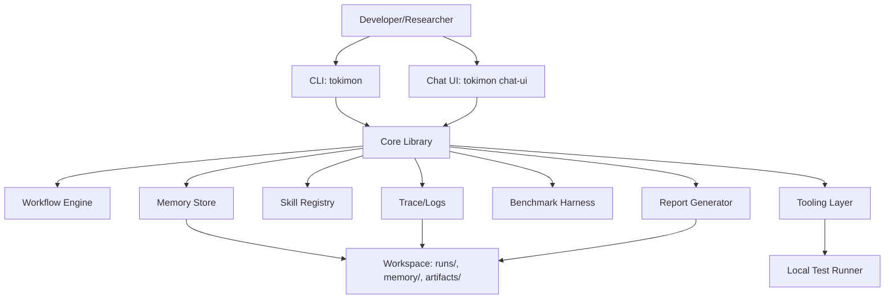
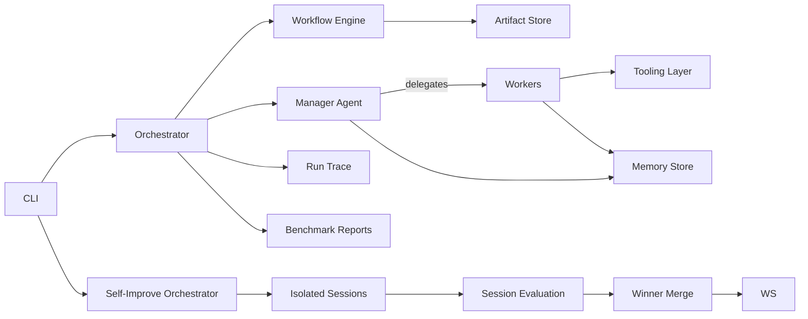

# C4 Level 2 - Containers - Tokimon

## Container Diagram


## Containers
- CLI: command interface for running tasks, suites, and inspecting runs.
- Chat UI: local web app (server + browser UI) for interactive chat with Tokimon.
- Core Library: orchestration, manager/worker logic, retry gating, skill lifecycle.
- Workflow Engine: DAG execution, persistence, resume.
- Memory Store: Lessons, artifact index, staged retrieval, lexical index.
- Tooling Layer: FileTool, PatchTool, PytestTool, GrepTool, WebTool (test runner is pluggable).
- Benchmark Harness: supports benchmark evaluation when invoked by operators, uses self-contained tasks.
- Trace/Logs: structured logs and trace.jsonl.

## Architecture Plan
This section consolidates the system architecture plan for Tokimon.

### Components and Responsibilities
- CLI (`tokimon`): entry point for running tasks, suites, resuming runs, inspecting artifacts, listing/building skills.
- Chat UI (`tokimon chat-ui`): local web server that serves a chat UI and routes messages into the core runner.
- Core Orchestrator: coordinates workflow execution, run state, and artifacts.
- Workflow Engine: validates DAGs, manages step state machine, persists state, and resumes runs.
- Manager Agent: converts goals into workflows, delegates to workers, enforces retry/novelty rules, and maintains delegation graph.
- Worker Agents: specialized roles (Planner, Implementer, Debugger, Reviewer, TestTriager, SkillBuilder) with limited tool access.
- Tooling Layer: FileTool, PatchTool, PytestTool, GrepTool, WebTool with structured schemas and timeouts.
- Memory Store: persistent Lessons and artifact index, staged retrieval, lexical index.
- Skill Registry: loads built-in and generated skills; supports hot reload.
- Skill Builder Pipeline: creates skill modules and manifest entries, runs tests, and registers on success.
- Model Integration: LLMClient abstraction with stub, mock, and optional Codex CLI-backed adapter.
- Benchmark Harness: supports benchmark evaluation by running tasks when invoked, collects metrics, and produces reports.
- Logging & Trace: structured logging, per-worker logs, consolidated trace.jsonl.
- Self-Improve Orchestrator: runs parallel “sessions” in isolated workspaces, evaluates each session, and merges the best result back to the master workspace with a report.

### Data Flow (High Level)


### On-Disk Layout
```
tokimon/ (repo)
  docs/
    c4/
  src/
    (project root; default workspace location)
    pyproject.toml
    README.md
    benchmarks/
      tasks/
    tests/
    skills_builtin/
    skills_generated/
    runs/
      run-<timestamp>-<id>/
        run.json
        workflow_state.json
        trace.jsonl
        logs/
          manager.log
          worker-<id>.log
        artifacts/
          steps/
            <step-id>/
              outputs.json
        lessons/
          lesson-<id>.md
        reports/
          suite-report.json
          suite-report.md
      self-improve/
        run-<timestamp>-<id>/
          self_improve.json
          self_improve.md
          sessions/
            session-<n>/
              workspace/        (clone of master used by that session)
              session.json      (plan, metrics, evaluation)
    memory/
      lessons/
      artifacts/
      index.sqlite
```

Note: The workspace is where Tokimon writes runs, memory, and artifacts. By default it lives under `src/`, but it can be configured to another path.

### Workflow Step State Machine
- NEW: created, not yet validated.
- READY: validated and dependencies satisfied.
- RUNNING: assigned to a worker.
- SUCCEEDED: outputs validated and persisted.
- SKIPPED: step was not needed (e.g., workflow terminated early after the goal was satisfied).
- FAILED: worker failed; may be eligible for retry if novelty and progress rules pass.
- BLOCKED: missing inputs or external preconditions.
- PARTIAL: produced artifacts but not full success.
- RETRY_PENDING: retry approved with Lesson and strategy change.

Transitions:
- NEW -> READY after schema validation.
- READY -> RUNNING when scheduled.
- RUNNING -> SUCCEEDED | FAILED | BLOCKED | PARTIAL.
- READY|NEW -> SKIPPED when workflow terminates early.
- FAILED/PARTIAL -> RETRY_PENDING if novelty/progress gating passes.
- RETRY_PENDING -> RUNNING with new call_signature.

### Retry Logic with Novelty and Progress Enforcement
- Each attempt computes a call_signature hash:
  - (goal, step_id, worker_type, key inputs, strategy_id, retrieval_stage)
- Before retry:
  - Manager writes a Lesson artifact explaining the failure and strategy change.
  - At least one dimension must change: root cause hypothesis, worker specialization, strategy class, tool sequence, plan decomposition granularity, or retrieval stage/scope.
  - Progress metrics must show measurable improvement or new evidence (e.g., fewer failing tests, new repro, new artifact delta).
- Block identical reruns:
  - If call_signature repeats without progress, retry is refused.
- Failure de-dup:
  - Hash (task id, call_signature, failure_signature) to detect repeated failures.
- Escalation:
  - If progress stalls, manager must escalate strategy (not repeat).
- If no concrete Lesson with a plan change is possible, the retry is an error and the step ends as FAILED/PARTIAL.

### Delegation Graph and Cycle Detection
- Maintain a per-run and per-step delegation graph:
  - Nodes: worker calls
  - Edges: delegation relationships
- Detect cycles by checking for repeated nodes in the current path.
- Detect repeated subtrees with no new artifacts by comparing artifact hashes across attempts.
- Block or escalate when a cycle or repeated subtree is found without new artifacts.

### Memory Format and Staged Retrieval
- Lessons are Markdown with a JSON header:
  - Metadata fields: id, timestamp, task_id, step_id, failure_signature, strategy_id, tags
- Artifact index entries reference producing step and file hashes.
- Staged retrieval:
  - Stage 1: top-k Lessons and key artifacts for current step and component.
  - Stage 2: broaden with related tags, adjacent components, and similar failure signatures.
  - Stage 3: targeted expansion by tags, components, and historical failures across tasks.
- Lexical index:
  - Default sqlite FTS for local search.
  - Optional embeddings interface defined but not required.

### Dynamic Skill Generation Lifecycle
1. Manager detects a gap and justifies a new skill.
2. SkillBuilder creates a module in `skills_generated/` and updates manifest.
3. SkillBuilder writes unit tests when feasible.
4. Run tests; if pass, register skill in SkillRegistry.
5. Persist a Lesson describing gap, design, and expected benefit.
6. SkillRegistry can hot reload generated skills at runtime.

### Parallel Execution Strategy and Consistency Guarantees
- Asyncio task queue schedules worker calls and workflow steps.
- Concurrency controller provides high concurrency with backpressure, timeouts, and cancellation.
- Per-step and per-worker logs are deterministic and stored under run folder.
- Consolidated trace.jsonl records state changes plus unrolled worker loops (model calls + tool calls/results) in order.
- Artifact writes are atomic; step output writes are versioned to avoid races.

### Self-Improvement (Batch Sessions)
- A self-improvement “run” executes one or more **batches**.
- Each batch spawns N **sessions** in parallel (threads/processes), each with an isolated workspace clone of master.
- Session workspaces are created via `git worktree` (detached HEAD) so sessions can run in parallel without colliding on files.
- Self-improve requires the master workspace to be a clean git checkout (no local changes); otherwise it aborts with an actionable error.
- For safety, cloning and merging may be restricted to a configured set of paths (defaults should include `src/` and `docs/`).
- Session workspaces should include the repo entrypoint `AGENTS.md` so agents can follow the documented start sequence.
- Before launching each batch, the orchestrator evaluates the current master (pytest by default) and provides the results summary to all sessions as context.
- Each session:
  - Receives the self-improvement goal plus optional input sources (URL/file/text).
  - Runs the hierarchical runner inside its workspace.
  - Uses the same evaluation command as a per-step check when available, so retries are progress-gated by objective signals (e.g., fewer failing tests).
  - Evaluates via automated checks (pytest by default; optionally the benchmark suite).
  - Produces a session report and an artifact diff versus master.
- After the batch:
  - A comparer selects the best session by a deterministic score (tests pass first, then secondary metrics).
  - The merger applies the winner back onto master (restricted to configured paths) using a conflict-aware git integration:
    - Create a temporary commit for the winner changes.
    - Apply via `git merge --squash` onto master, then re-run evaluation.
    - On success, commit the squashed changes to keep master clean for subsequent batches.
    - Use an OS-level lock so multiple self-improve runs perform safe queued merges into the same checkout.
    - On merge conflicts, automatically resolve (prefer winner changes) and continue; on failing evaluation, abort and leave master unchanged (winner workspace remains available for manual review).
  - A batch report is persisted with links to session artifacts and the merged changes.
