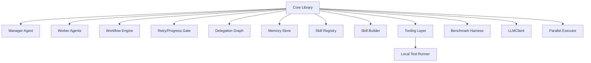

# C4 Level 3 - Components - Tokimon Core

## Component Diagram (Core Library)

## Component Responsibilities
- Manager Agent: plan workflows, delegate to workers, enforce novelty gates, maintain graph.
- Worker Agents: specialized execution with structured outputs and tool access.
- Workflow Engine: step validation, state machine, persistence/resume.
- Retry/Progress Gate: call_signature hashing, progress metrics, refusal logic.
- Delegation Graph: cycle detection and repeated subtree checks.
- Memory Store: Lessons and artifact index, staged retrieval, lexical search.
- Skill Registry/Builder: hot load generated skills, create skills with tests.
- Tooling Layer: filesystem and test tools with schemas; test runner adapters are pluggable (default: pytest).
- Benchmark Harness: runs benchmark evaluations when invoked, using self-contained tasks and producing reports.
- LLMClient: abstraction with stub/mock/placeholder.
- Parallel Executor: async task queue, concurrency control.

## Notes
- The workspace is where Tokimon writes runs, memory, and artifacts; it is configurable and defaults under the repo root.
